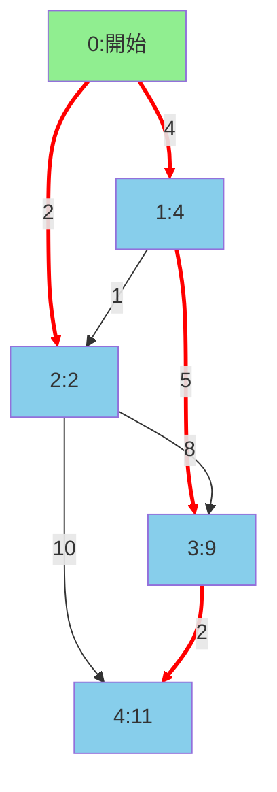

# ダイクストラ最短経路アルゴリズムの可視化

## アルゴリズムの結果

### 各ノードへの最短距離
- ノード0: 0 (開始点)
- ノード1: 4
- ノード2: 2
- ノード3: 9
- ノード4: 11

### 最短経路
- ノード0への最短経路: 0 (距離: 0)
- ノード1への最短経路: 0 → 1 (距離: 4)
- ノード2への最短経路: 0 → 2 (距離: 2)
- ノード3への最短経路: 0 → 1 → 3 (距離: 9)
- ノード4への最短経路: 0 → 1 → 3 → 4 (距離: 11)

## グラフの可視化

### 凡例
- 🟢 緑色ノード: 開始ノード (ノード0)
- 🔵 青色ノード: 到達可能ノード
- 🔴 赤い線: 最短経路のエッジ
- 各ノードの数字: そのノードまでの最短距離

### アルゴリズムの説明
1. 開始ノード(0)から各ノードへの最短距離を計算
2. 優先度付きキューを使用して効率的に探索
3. 各ノードの最短距離と前のノードを記録
4. 最短経路は前のノードを逆算して復元